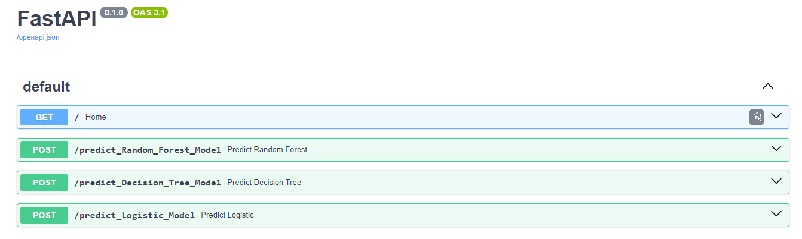

<div align="center">
    
</div>

<div align="center">
  <h1><b>FastAPI-Sepsis-Prediction-API</b></h1>
</div>

# 📕 Table of Contents

- [📕 Table of Contents](#table-of-contents)
- [🎈 Introduction](#introduction)
- [♻ Data Features](#data-features)
- [📝 Overview](#overview)
- [📊 Exploratory Data Analysis](#Exploratory-Data-Analysis)
- [🔧 Installation](#installation)
- [🚀 Usage](#usage)
- [📝 Article](#article)
- [🤝 Contributing](#contributing)
- [🔏 License](#license)
- [📚 References](#references)
- [👤 Author](#author)

## 🎈 Introduction
In the fast-paced world of healthcare, every second counts. Timely intervention can mean the difference between life and death, especially when it comes to critical conditions like sepsis. Our FastAPI Sepsis Prediction project aims to harness the power of AI to transform patient care and save lives by predicting sepsis onset in real-time.

## ♻ Data Features
- **ID**: Unique patient identification number.
- **PRG**: Plasma glucose level (mmol/L).
- **PL**: Blood work result 1 (mu U/ml).
- **PR**: Blood pressure (mm Hg).
- **SK**: Blood work result 2 (mm).
- **TS**: Blood work result 3 (mu U/ml).
- **M11**: Body mass index (weight in kg/(height in m)²).
- **BD2**: Blood work result 4 (mu U/ml).
- **Age**: Patient’s age (years).
- **Insurance**: Indication of whether the patient holds a valid insurance card.
- **Sepsis**: Classification indicating whether the patient has sepsis (Positive) or not (Negative).

## 📝 Overview
This project utilizes machine learning algorithms and FastAPI to predict sepsis onset in real-time. By analyzing patient data, our API provides clinicians with early warnings of potential sepsis occurrences, enabling proactive intervention and improved patient outcomes.

## 📊 Exploratory Data Analysis
Explore the dataset used for training the machine learning model. View data visualizations and insights gained from the analysis in the [Exploratory Data Analysis](./notebooks.ipynb) notebook.


## 🔧 Installation
1. Clone this repository to your local machine.
    ```bash
    git clone https://github.com/Elphoxa/FastAPI-Sepsis-Prediction-API.git
    ```
2. Navigate into the repository directory:
   
    ```bash
    cd FastAPI-Sepsis-Prediction-API
    ```

3. Create a virtual environment

    ```bash
    python -m venv env
    ```

4. Activate the virtual environment

    ```bash
    virtual_env/Scripts/activate
    ```
5. Install the required dependencies
    ```bash
    pip install -r requirements.txt
    ```
## 🚀 Usage
1. Navigate to `main.py`
2. Run the FastAPI application:
    ```bash
    uvicorn app:app --host 0.0.0.0 --port 8000
    ```
3. Access the API endpoints to predict sepsis onset and integrate the API into existing healthcare systems.



**Docker Image:** The Docker image for the FastAPI Sepsis Prediction API is available on [Docker Hub](https://hub.docker.com/repository/docker/elphoxa56/fastapi-sepsis-prediction-api).

## 📝 Article
Read the article on this project [Here](https://www.linkedin.com/pulse/revolutionizing-healthcare-ai-predicting-sepsis-efosa-dave-omosigho-kmhvf)

## 🤝 Contributing
If you'd like to contribute to this project, please follow these steps:

- Fork the repository.
- Create a new branch (git checkout -b feature/your-feature).
- Make your changes.
- Commit your changes (git commit -am 'Add some feature').
- Push to the branch (git push origin feature/your-feature).
- Create a new Pull Request.

## 🔏 License
This project is licensed under the MIT License. See the [LICENSE](LICENSE) file for details.

## 📚 References
- [FastAPI Documentation](https://fastapi.tiangolo.com/)
- [Scikit-learn Documentation](https://scikit-learn.org/stable/documentation.html)
- [Docker Documentation](https://docs.docker.com/)
- [Docker Hub](https://hub.docker.com/)

## 👤 AUTHOR
🤵 **Efosa Dave Omosigho**
- [GitHub Profile](https://github.com/Elphoxa) 🐙
- [LinkedIn Profile](https://www.linkedin.com/in/efosa-omosigho) 💼
